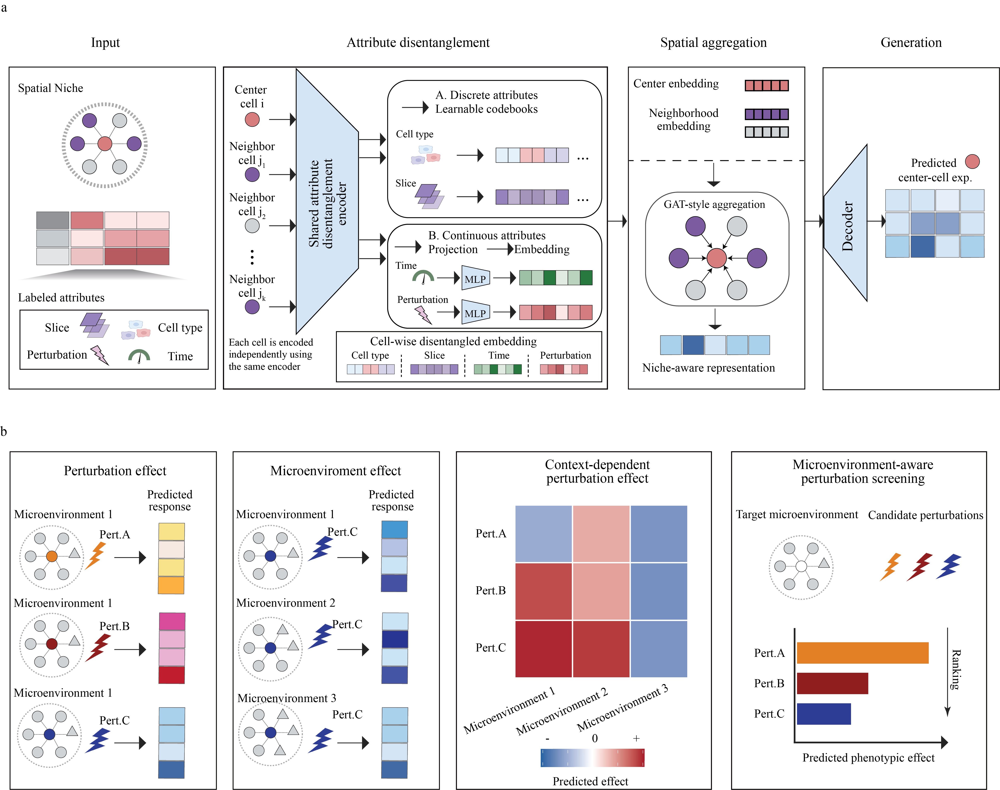

# VirtNiche

**A niche-aware generative model for spatial perturbation omics.**

VirtNiche predicts the molecular response of a focal cell conditioned on its perturbation, cell identity, and local spatial microenvironment. By representing cellular attributes separately and aggregating the attributes of spatial neighbors, VirtNiche supports prediction in experimentally unobserved combinations of perturbations, cell types, and niches.

<p align="center">
  
</p>

## Repository

```text
VirtNiche/
├── VirtNiche/                         # Core model implementation
│   ├── _model.py                       # High-level model API
│   ├── _module.py                      # Neural modules and niche aggregation
│   ├── _train.py                       # Training plan and optimization
│   ├── _data.py                        # Data splitting utilities
│   └── _utils.py                       # Spatial neighbors and metrics
├── Demo_Notebook/
│   ├── 1.Perturbation_embedding_annotation.ipynb
│   ├── 2.Masking.ipynb
│   ├── 3.VirtNiche_train.ipynb
│   ├── 4.Virtual_Niche_Analysis.ipynb
│   └── CellHermes-Embedding/
├── Figure/Model.png                   # Model overview
├── Figure/Model.pdf                   # Vector version of the overview
├── environment.yml
└── LICENSE
```

## Installation

The demo environment is defined in `environment.yml` and uses Python 3.9, PyTorch 2.0.1, CUDA 11.7, scvi-tools and Scanpy.

```bash
conda env create -f environment.yml
conda activate VirtNiche
```

## Data and inputs

The notebooks use the Perturb-FISH example from SpaPerturBase. Download the raw `Measured.h5ad` file from the [SpaPerturBase dataset](https://huggingface.co/delta-tj/datasets/SpaPerturBase) and place it in:

```text
Demo_Notebook/Perturb-FISH-rawadata/Measured.h5ad
```

The perturbation embeddings used by the demo are included in the repository:

```text
Demo_Notebook/CellHermes-Embedding/CellHermes_embbding_Perturb-FISH.pkl
```

The preprocessing notebooks generate the following intermediate files:

```text
Measured_annotated.h5ad
Measured_annotated_splited.h5ad
```

The training notebook saves a model directory named `VirtNiche_Perturb_FISH_test_model/`. A pretrained model can alternatively be placed at that path before running notebook 4 when a released model archive is available (Zenodo DOI: `10.5281/zenodo.22760559`).

VirtNiche expects an `AnnData` object with the following fields:

| Location       | Key              | Description                               |
| -------------- | ---------------- | ----------------------------------------- |
| `adata.X`    | -                | Molecular measurements                    |
| `adata.obs`  | `perturb`      | Perturbation identity                     |
| `adata.obs`  | `cell_type`    | Cell-type annotation                      |
| `adata.obs`  | `split`        | `train`, `val`, or `ood` assignment |
| `adata.obsm` | `spatial`      | Spatial coordinates                       |
| `adata.obsm` | `perturb_gene` | Perturbation embedding                    |

## Reproduce the demo

Run the notebooks from `Demo_Notebook/` in the following order:

1. **Perturbation embedding annotation** loads the Perturb-FISH data and attaches CellHermes perturbation embeddings as `adata.obsm["perturb_gene"]`.
2. **Masking** builds perturbation-cell-type niche labels, constructs spatial neighborhoods, and creates validation/OOD splits. The example holds out `MAP3K7` and `JUN` as OOD perturbations.
3. **VirtNiche training** constructs the model and trains it with a GAT-style neighborhood aggregator.
4. **Virtual Niche Analysis** loads the trained model, predicts user-defined virtual niches, and compares perturbations with a control condition.

## Minimal training example

```python
import scanpy as sc
import VirtNiche
from VirtNiche._utils import compute_spatial_neighbors

adata = sc.read("Demo_Notebook/Perturb-FISH-rawadata/Measured_annotated_splited.h5ad")
neighbors_index = compute_spatial_neighbors(
    adata, n_neighbors=6, spatial_key="spatial"
)

VirtNiche.VirtNiche.setup_anndata(
    adata,
    ordered_attributes_keys=["perturb_gene"],
    categorical_attributes_keys=["cell_type"],
)

model = VirtNiche.VirtNiche(
    adata,
    n_latent=32,
    module_params={
        "neighbors_index": neighbors_index,
        "agg_mode": "gat",
        "gene_likelihood": "nb",
    },
    split_key="split",
    train_split="train",
    valid_split="val",
    test_split="ood",
)

model.train(max_epochs=500, batch_size=512)
model.save()
```

## Citation

If you use VirtNiche, please cite the accompanying manuscript:

> *Towards building the AI virtual niche based on spatial perturbation omics.*

The manuscript introduces SpaPerturBase, SpaPerturBench, and VirtNiche as an integrated data, benchmark, and modeling framework.

## License

VirtNiche is released under the [Apache License 2.0](LICENSE).
